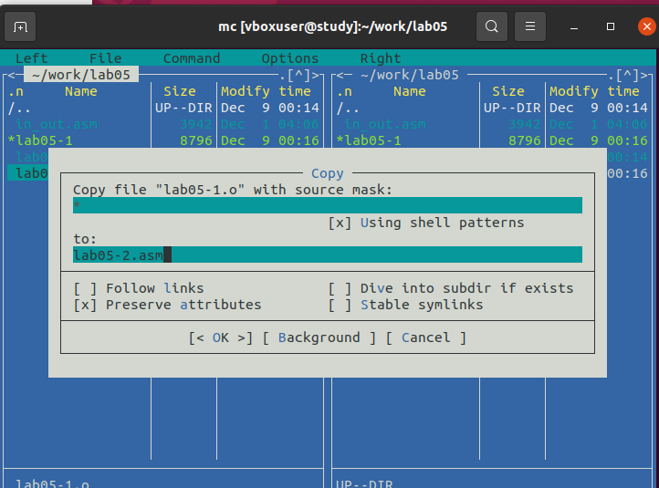

---
## Front matter
title: "Отчёт по лабораторной работе 5"
subtitle: "Архитектура компьютера"
author: "Тарасова Анна"

## Generic otions
lang: ru-RU
toc-title: "Содержание"

## Bibliography
bibliography: bib/cite.bib
csl: pandoc/csl/gost-r-7-0-5-2008-numeric.csl

## Pdf output format
toc: true # Table of contents
toc-depth: 2
lof: true # List of figures
lot: true # List of tables
fontsize: 12pt
linestretch: 1.5
papersize: a4
documentclass: scrreprt
## I18n polyglossia
polyglossia-lang:
  name: russian
  options:
	- spelling=modern
	- babelshorthands=true
polyglossia-otherlangs:
  name: english
## I18n babel
babel-lang: russian
babel-otherlangs: english
## Fonts
mainfont: PT Serif
romanfont: PT Serif
sansfont: PT Sans
monofont: PT Mono
mainfontoptions: Ligatures=TeX
romanfontoptions: Ligatures=TeX
sansfontoptions: Ligatures=TeX,Scale=MatchLowercase
monofontoptions: Scale=MatchLowercase,Scale=0.9
## Biblatex
biblatex: true
biblio-style: "gost-numeric"
biblatexoptions:
  - parentracker=true
  - backend=biber
  - hyperref=auto
  - language=auto
  - autolang=other*
  - citestyle=gost-numeric
## Pandoc-crossref LaTeX customization
figureTitle: "Рис."
tableTitle: "Таблица"
listingTitle: "Листинг"
lofTitle: "Список иллюстраций"
lotTitle: "Список таблиц"
lolTitle: "Листинги"
## Misc options
indent: true
header-includes:
  - \usepackage{indentfirst}
  - \usepackage{float} # keep figures where there are in the text
  - \floatplacement{figure}{H} # keep figures where there are in the text
---

# Цель работы

Целью работы является приобретение практических навыков работы в Midnight Commander. 
Освоение инструкций языка ассемблера mov и int.

# Выполнение лабораторной работы

1. Я открыла Midnight Commander и перешла в каталог ~/work/arch-pc. Создала каталог lab05, чтобы выполнить задание.

{ #fig:001 width=70%, height=70% }

2. Внутри каталога lab05 я создала файл lab05-1.asm и открыла его для редактирования. Написала код программы внутри файла.

{ #fig:002 width=70%, height=70% }

3. После этого я открыла файл lab05-1.asm для просмотра и проверила написанный код.

{ #fig:003 width=70%, height=70% }

4. Скомпилировала программу и проверила ее работу, получив исполняемый файл. Тщательно проверила, как программа функционирует.

{ #fig:004 width=70%, height=70% }

5. Скачала файл in_out.asm и добавила его в рабочий каталог. Затем скопировала файл lab05-1.asm и создала копию с именем lab05-2.asm.

{ #fig:005 width=70%, height=70% }

6. В файле lab05-2.asm я написала код программы и скомпилировала его. Проверила запуск программы и убедилась, что она работает должным образом.

{ #fig:006 width=70%, height=70% }

{ #fig:007 width=70%, height=70% }

7. Внесила изменения в файл lab05-2.asm, заменив подпрограмму sprintLF на sprint. Пересобрала исполняемый файл. Теперь строки выводятся без перехода на новую строку.

{ #fig:008 width=70%, height=70% }

{ #fig:009 width=70%, height=70% }

## Задание для самостоятельной работы

1. Скопировала программу lab05-1.asm и внесла изменения в код, чтобы добавить приглашение "Введите строку:", считать строку с клавиатуры и вывести ее на экран.

{ #fig:010 width=70%, height=70% }

{ #fig:011 width=70%, height=70% }

2. Скопировала программу lab05-2.asm и провела аналогичные изменения, используя возможности из файла in_out.asm. Теперь программа считывает и выводит строки с помощью соответствующих подпрограмм.

{ #fig:012 width=70%, height=70% }

{ #fig:013 width=70%, height=70% }

# Выводы

Научились писать базовые ассемблерные программы. Освоили ассемблерные инструкции mov и int.