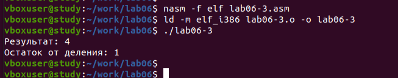

---
## Front matter
title: "Отчёт по лабораторной работе 6"
subtitle: "Архитектура компьютера"
author: "Тарасова Анна"

## Generic otions
lang: ru-RU
toc-title: "Содержание"

## Bibliography
bibliography: bib/cite.bib
csl: pandoc/csl/gost-r-7-0-5-2008-numeric.csl

## Pdf output format
toc: true # Table of contents
toc-depth: 2
lof: true # List of figures
lot: true # List of tables
fontsize: 12pt
linestretch: 1.5
papersize: a4
documentclass: scrreprt
## I18n polyglossia
polyglossia-lang:
  name: russian
  options:
	- spelling=modern
	- babelshorthands=true
polyglossia-otherlangs:
  name: english
## I18n babel
babel-lang: russian
babel-otherlangs: english
## Fonts
mainfont: PT Serif
romanfont: PT Serif
sansfont: PT Sans
monofont: PT Mono
mainfontoptions: Ligatures=TeX
romanfontoptions: Ligatures=TeX
sansfontoptions: Ligatures=TeX,Scale=MatchLowercase
monofontoptions: Scale=MatchLowercase,Scale=0.9
## Biblatex
biblatex: true
biblio-style: "gost-numeric"
biblatexoptions:
  - parentracker=true
  - backend=biber
  - hyperref=auto
  - language=auto
  - autolang=other*
  - citestyle=gost-numeric
## Pandoc-crossref LaTeX customization
figureTitle: "Рис."
tableTitle: "Таблица"
listingTitle: "Листинг"
lofTitle: "Список иллюстраций"
lotTitle: "Список таблиц"
lolTitle: "Листинги"
## Misc options
indent: true
header-includes:
  - \usepackage{indentfirst}
  - \usepackage{float} # keep figures where there are in the text
  - \floatplacement{figure}{H} # keep figures where there are in the text
---

# Цель работы

Целью работы является освоение арифметических инструкций языка ассемблера NASM.

# Выполнение лабораторной работы

1. Я создала папку для программ лабораторной работы номер шесть, затем перешла в неё и сформировала файл с названием lab6-1.asm.

2. Давайте посмотрим на примеры программ, которые выводят символы и числовые данные. 
Эти программы будут отображать информацию, которую мы поместим в регистр eax. 

В одной из программ я поместила символ '6' в регистр eax, используя команду mov eax, 
'6', а затем записала символ '4' в регистр ebx с помощью команды mov ebx, '4'. 
После этого я сложила значения из регистров eax и ebx, применив команду add eax, ebx, 
и результат сложения сохранился в регистре eax. Затем я хотела вывести получившийся 
результат. Но поскольку для работы функции sprintLF необходимо, чтобы в регистре eax 
был адрес, мне понадобилась дополнительная переменная. Я перенесла значение из регистра 
eax в переменную buf1, используя команду mov [buf1], eax. Потом я поместила адрес 
переменной buf1 обратно в регистр eax с помощью команды mov eax, buf1 и вызвала функцию 
sprintLF, чтобы вывести результат на экран.

{ #fig:001 width=70%, height=70% }

В данном случае при выводе значения регистра eax мы ожидаем увидеть число 10. 
Но вместо этого там оказывается символ 'j'. Это связано с тем, что 
в компьютерном представлении код символа '6' равен 00110110 в двоичном формате, 
что соответствует 54 в десятичной системе, а код символа '4' - это 00110100, 
или 52 в десятичных числах. Когда выполняется команда add eax, ebx, в регистр 
eax записывается сумма этих кодов, которая равна 01101010 в двоичной системе, 
или 106 в десятичной, и это именно код для символа 'j'.

{ #fig:002 width=70%, height=70% }

3. Далее изменяю текст программы и вместо символов, запишем в регистры числа. 

{ #fig:003 width=70%, height=70% }

Как и в прошлый раз, когда мы запускали программу, число 10 не появится. 
На этот раз на экране появится символ, который соответствует коду 10. Этот символ 
означает конец строки, или возврат каретки. В консоли он не виден, но он создает 
пустую строку в выводе.

{ #fig:004 width=70%, height=70% }

4. Как отмечалось выше, для работы с числами в файле in_out.asm реализованы 
подпрограммы для преобразования ASCII символов в числа и обратно. 
Преобразовала текст программы с использованием этих функций.

{ #fig:005 width=70%, height=70% }

Когда я запустила программу, она выдала мне число 106. Это произошло потому, 
что команда add сложила ASCII коды символов '6' и '4', что в сумме дало 106. 
Важно отметить, что в этот раз, в отличие от предыдущей программы, я использовала 
функцию iprintLF, которая позволила мне вывести именно число, а не символ, 
соответствующий этому числовому коду.

{ #fig:006 width=70%, height=70% }

5. Аналогично предыдущему примеру изменим символы на числа.

{ #fig:007 width=70%, height=70% }

Функция iprintLF позволяет вывести число и операндами были числа (а не коды символов).
Поэтому получаем число 10.

{ #fig:008 width=70%, height=70% }

Заменила функцию iprintLF на iprint. Создала исполняемый файл и запустила его. 
Вывод отличается тем, что нет переноса строки.

{ #fig:009 width=70%, height=70% }

6. В качестве примера выполнения арифметических операций в NASM приведем 
программу вычисления арифметического выражения 
$$f(x) = (5 * 2 + 3)/3$$.

{ #fig:010 width=70%, height=70% }

{ #fig:011 width=70%, height=70% }

Изменила текст программы для вычисления выражения 
$f(x) = (4 * 6 + 2)/5$. 
Создала исполняемый файл и проверила его работу.

{ #fig:012 width=70%, height=70% }

{ #fig:013 width=70%, height=70% }

7. В качестве другого примера рассмотрим программу вычисления варианта задания по 
номеру студенческого билета.

В данном случае число, над которым необходимо проводить арифметические операции,
вводится с клавиатуры. Как отмечалось выше ввод с клавиатуры осуществляется 
в символьном виде и для корректной работы арифметических операций в NASM символы 
необходимо преобразовать в числа. Для этого может быть использована функция 
atoi из файла in_out.asm.

{ #fig:014 width=70%, height=70% }

{ #fig:015 width=70%, height=70% }

## ответы на вопросы

1. Какие строки листинга отвечают за вывод на экран сообщения ‘Ваш вариант:’?

- Команда `mov eax, rem` загружает в регистр `eax` адрес строки с текстом "Ваш вариант:".

- Использование `call sprint` запускает функцию, которая выводит строку на экран.

2. Для чего используется следующие инструкции?
 
- `mov ecx, x` помещает в регистр `ecx` значение переменной `x`.

- `mov edx, 80` устанавливает в регистре `edx` значение 80.

- `call sread` активирует функцию чтения данных, которая считывает номер студенческого билета в переменную `x`.

3. Для чего используется инструкция “call atoi”?

Функция `atoi` конвертирует строковые данные в целочисленное значение.

4. Какие строки листинга отвечают за вычисления варианта?

- `xor edx, edx` обнуляет регистр `edx`.

- `mov ebx, 20` помещает число 20 в регистр `ebx`.

- `div ebx` выполняет деление аккумулятора на значение в `ebx`, результат в `eax`, остаток в `edx`.

- `inc edx` увеличивает значение в регистре `edx` на единицу, что соответствует логике расчета варианта.

5. В какой регистр записывается остаток от деления при выполнении инструкции “div ebx”?

- Остаток от деления сохраняется в регистре `edx`.

6. Для чего используется инструкция “inc edx”?

- Команда `inc edx` увеличивает значение в регистре `edx` на 1 для корректного расчета варианта по заданной формуле.

7. Какие строки листинга отвечают за вывод на экран результата вычислений? 

- `mov eax, edx` переносит результат вычислений из регистра `edx` в регистр `eax`.

- `call iprintLF` запускает функцию, которая выводит значение из регистра `eax` на экран с переводом строки.

## Задание для самостоятельной работы

8. Написать программу вычисления выражения y = f(x). Программа должна выводить выражение 
для вычисления, выводить запрос на ввод значения x, 
вычислять заданное выражение в зависимости от введенного x, выводить результат вычислений. 
Вид функции f(x) выбрать из таблицы 6.3 вариантов заданий в соответствии с номером 
полученным при выполнении лабораторной работы. 
Создайте исполняемый файл и проверьте его работу для значений x1 и x2 из 6.3.

Получили вариант 8 - $$(14 + x)*2 - 6$$  для $$x_{1}=1, x_{2}=9$$

{ #fig:016 width=70%, height=70% }

{ #fig:017 width=70%, height=70% }

# Выводы

Изучили работу с арифметическими операциями.